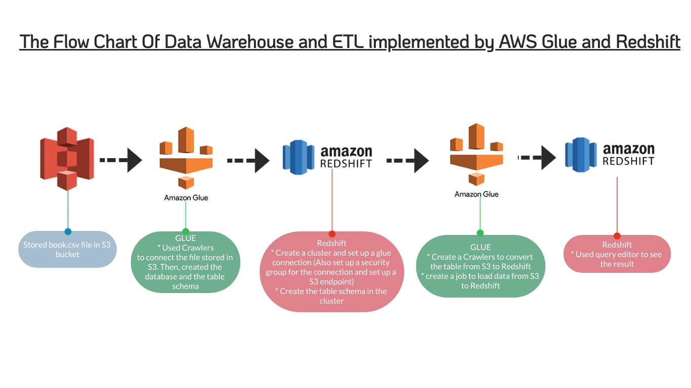

# Data Warehouse and ETL implemented by AWS Glue and Redshift

__Motivation:__\
To brush up my ETL memory and also practice AWS redshift (data warehouse) and AWS glue (ETL tool), I stored a 'book.csv' file in to S3. Then, used glue to transform all the data into redshift.

# The project's flow chart

# References
[Data](https://www.kaggle.com/jealousleopard/goodreadsbooks?select=books.csv)\
[Tutorial Link 1](https://www.youtube.com/playlist?list=PL3GCZkoyKK4fEUDH2UMMj0eumx2NqPP1J)\
[Tutorial link 2](https://www.youtube.com/watch?v=8t5pNcSnebQ&t=11s)\
[Handling the error when connected glue to redshift.](https://stackoverflow.com/questions/46531522/glue-job-for-redshift-connection-unable-to-find-suitable-security-group)\
[Handling S3 endpoint error](https://stackoverflow.com/questions/55972886/could-not-find-s3-endpoint-or-nat-gateway-for-subnetid)
