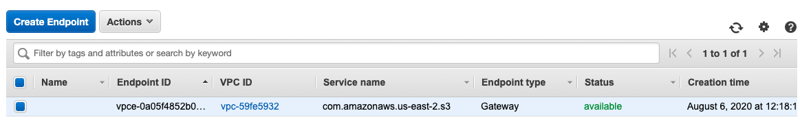

# Data Warehouse and ETL implemented by AWS Glue and Redshift

__Motivation:__\
To brush up my ETL memory and also practice AWS redshift (data warehouse) and AWS glue (ETL tool), I stored a 'book.csv' file in to S3. Then, used glue to transform all the data into redshift.

# The project's flow chart

__Step 1. Store books.csv file into S3__\
The easiest part in this project. Just upload the file into S3.

__Step 2. Glue - Crawlers__

A crawler connects to a data store, progresses through a prioritized list of classifiers to determine the schema for your data, and then creates metadata tables in your data catalog.\
This function can help you creating Table schema effortless.

__Step 3. Redshift - Create a cluster and set up SG & S3 Endpoint__
\
This step stuck me over 4 hours. You need to set up the right security group. Otherwise, you will encounter an S3 connection error in the final step. If you want to avoid this problem, follow the set up in the below pictures. If you want to see more detail, click [here](https://docs.aws.amazon.com/glue/latest/dg/setup-vpc-for-glue-access.html).

__Inbound & Outbound rule__\
\
\

__S3 Endpoint__
\

__Step 4. Glue - Create a Job__

A job is your business logic required to perform extract, transform and load (ETL) work. Job runs are initiated by triggers which can be scheduled or driven by events. It can generate the ETL code automatically.
\

__Step 5. Redshift - Used query editor to see a result__
\
__

# Summary
ETL is an important concept in the data analysis field and AWS makes implementing ETL easily. However, during this project, I learned a lot of new things related to  AWS configuration. Setting up an SG (inbound & outbound rule) is really complex. I need to do more research in this field! Anyway, hope you can gain something from this project and see you in the next project!

# References
[Data](https://www.kaggle.com/jealousleopard/goodreadsbooks?select=books.csv)\
[Tutorial Link 1](https://www.youtube.com/playlist?list=PL3GCZkoyKK4fEUDH2UMMj0eumx2NqPP1J)\
[Tutorial link 2](https://www.youtube.com/watch?v=8t5pNcSnebQ&t=11s)\
[Handling the error when connected glue to redshift.](https://stackoverflow.com/questions/46531522/glue-job-for-redshift-connection-unable-to-find-suitable-security-group)\
[Handling S3 endpoint error](https://stackoverflow.com/questions/55972886/could-not-find-s3-endpoint-or-nat-gateway-for-subnetid)
[setting up redshift connecting to s3](https://docs.aws.amazon.com/glue/latest/dg/setup-vpc-for-glue-access.html)
[How to find S3 prefix id](https://docs.aws.amazon.com/vpc/latest/userguide/managed-prefix-lists.html)
